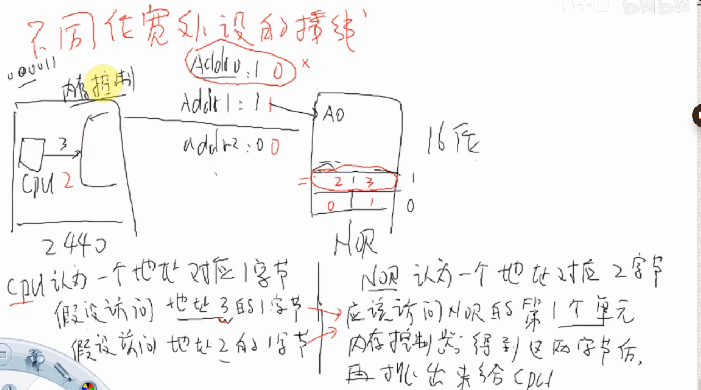
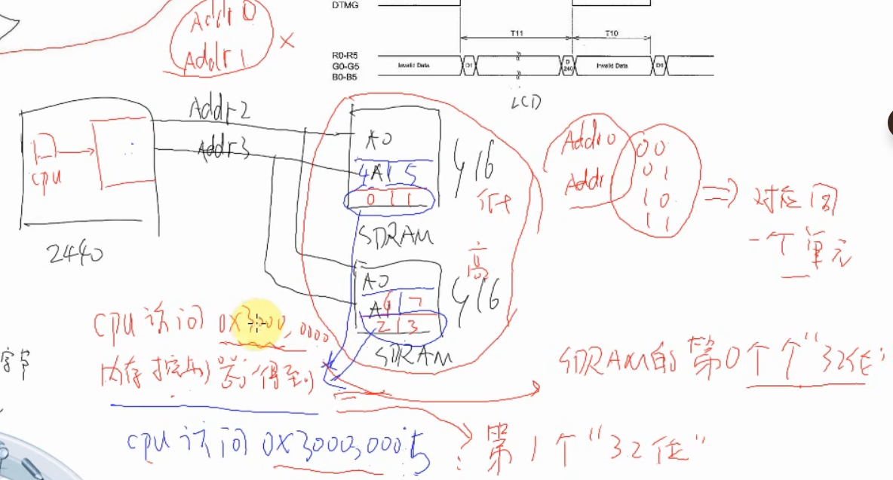

# 概述
SDRAM,HOR,网卡等等，共用地址线和数据线，通过片选线选择 

- 地址线、数据线上接有众多的设备，怎样做到只访问其中一个而避免其余的影响？
	每一个芯片都有单独的片选引脚，访问它之前先设置片选引脚为低电平，其他芯片的片选引脚为高电平。
- 片选引脚是否需要手工设置？
	不需要，CPU访问某个地址时，CPU发地址信号给“内存控制器”，内存控制器根据该地址决定让哪一个片选引脚输出低电平，内存映射

不同位宽外设的接线

cpu认为一个地址一字节，而NOR认为一个地址两字节
假设访问地址3的应该访问NOR地址单元1,所以ADDR0不需要了
0123组成一个32位地址单元 ，cpu直接访问一个单元